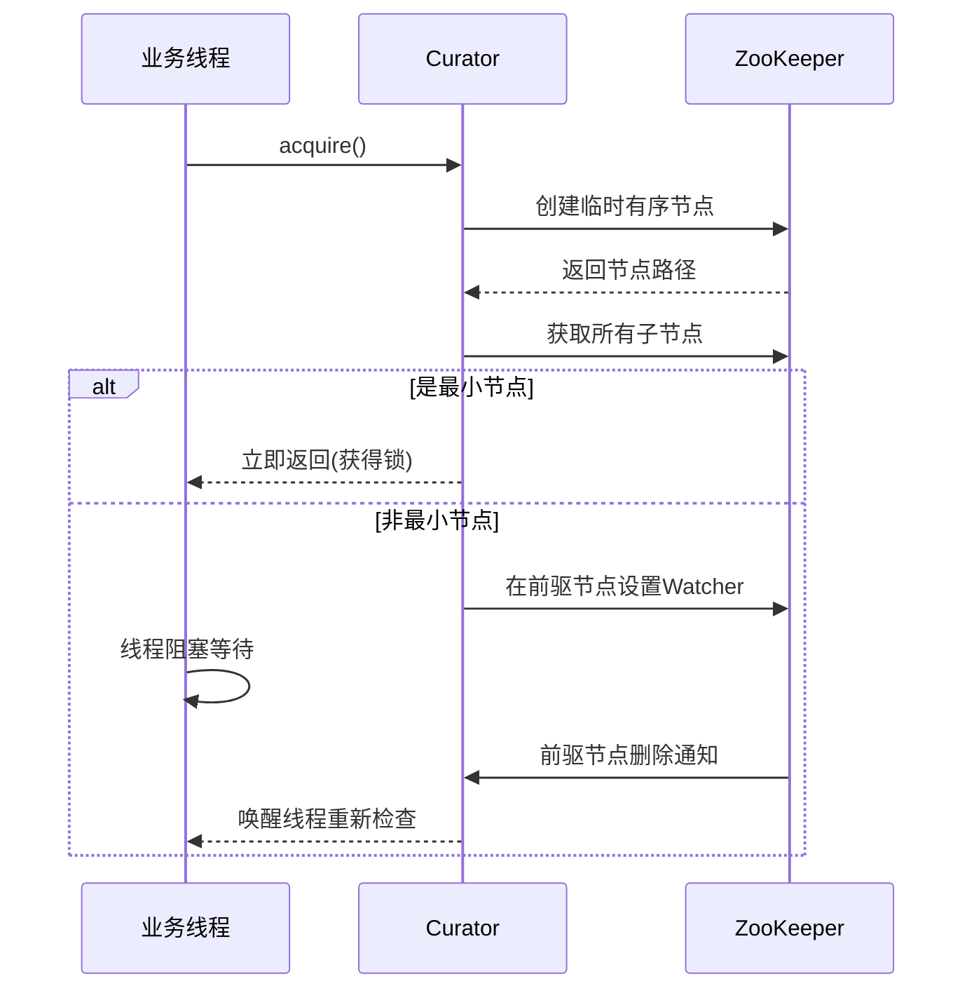

## 概述

举例：解决 MySQL 库存超卖问题。

**方案 1**：**单机时**可以使用 **JVM 本地锁**来解决，但要注意事务、多例模式导致的锁失效。应在事务之外加解锁，否则由于事务隔离级别 (一般是 RC、RR)，MVCC 会导致读到的是快照数据。

**方案 2**：使用**单 sql 语句**解决，如 `update stock set cnt=cnt-1 where product_id=1`，优点是并发量比使用 JVM 本地锁要高，但需要注意：

1. 只适用于简单业务场景、无法记录库存变化状态；
2. 期望锁的粒度为行级锁，参考 [[Database/MySQL事务与并发控制和锁|MySQL事务与并发控制和锁]]，查询字段必须使用索引，否则可能会锁表；

**方案 3**：使用 **MySQL 悲观锁** `select xxx from stock for update`，可以用于复杂业务场景。需要注意代码中应使用手动事务，并采用合适的索引。存在问题如下：

1. 性能问题，并发量稍优于 JVM 本地锁，劣于方案 2 单 sql 方式；
2. 对多条数据的**加锁顺序**可能导致**死锁**问题。例如事务 A 锁定了行 1，然后尝试锁定行 2，同时，事务 B 锁定了行 2，然后尝试锁定行 1。应当利用数据库的死锁检测机制 (自动回滚其中一个消耗小的事务)，在编码时就考虑因死锁导致的事务回滚，并实现相应的重试逻辑。

**方案 4**：**乐观锁**，使用 CAS (Compare And Swap) 的思想不加锁。

```sql
-- 先查询
select id, cnt, version from stock where product_id=1;
-- 再更新库存与版本号，根据影响条数判断成功失败
update stock set cnt=xx, version=version+1 where id=xx and version=xx;
```

优点是减少了锁创建释放的开销，适合读多写少场景，缺点：
1. 高并发下有大量的重试，会浪费 CPU、降低吞吐量；
2. ABA 问题，通过使用版本号或时间戳解决，这就是为什么不直接使用库存字段判断；
3. 读写分离情况下，由于主从数据同步延迟，导致乐观锁不可靠。

在分布式微服务高并发、业务复杂的情况下，基于数据库实现乐观锁/悲观锁会有较大压力，因此需要使用**分布式锁**。分布式锁可以基于 MySQL、Redis 或分布式协调服务 ZooKeeper、etcd 等来实现。

实现分布式锁需要考虑：  
- 原子性，获取锁的行为不可再拆分；
- 互斥，不能同时被多方持有；
- 防误删（只有持有锁的人才可以释放锁）；
- 防止死锁：
    - 可重入（引入计数机制）；
    - 超时自动释放；
- 自动续期；
- 极端场景锁失效问题。

可重入的必要性：例如 `methodA()` 调用 `methodB()`，而这两个方法都需要对共享资源进行操作，因此它们需要获取同一把锁来保证数据一致性。

## 基于 MySQL 实现

### 分析

使用悲观锁来实现原子性；使用唯一键实现互斥；添加持有者标识字段实现防误删；添加计数字段实现可重入；重置获取锁的时间来实现自动续期；对于超时自动释放比较难实现，可以考虑获取锁时比对该锁的上次获取时间字段，判断是否超过阈值，若超时则直接剥夺。

**表结构**：

```sql
create table distributed_lock
(
    lock_key        varchar(255)  not null comment '锁标识（主键）'
        primary key,
    holder_id       varchar(255)  not null comment '持有者标识 uuid',
    reentrant_count int default 0 not null comment '重入次数',
    expire_time     datetime      not null comment '过期时间'
) comment '分布式锁表';
```

**思路**：

`INSERT INTO ... ON DUPLICATE KEY UPDATE` 无论有没有冲突，都至少返回 1，若发生了修改则返回 2，即没有返回 0 的情况，无法判断是否获取锁，即无法使用单条语句来实现需求。

使用 `SELECT ... FOR UPDATE` 添加锁来解决多条语句执行的原子性问题，隔离级别 RC、RR 区别是是否有间隙锁，为了不锁住其他 lock_key，使用 RC 避免间隙锁 (也减小了死锁概率)。MySQL `8.x` 版本可以使用 `FOR UPDATE NOWITE` 来快速失败，避免阻塞。

* 先 select for update 申请写锁，判断是否有数据：
    * 无数据，则插入，RC 情况下不锁间隙，先插入先成功返回 true，后插入报唯一键冲突返回 false；
    * 有数据，加行锁，判断是否是自己持有的锁：
        * 是，则重入并更新时间，返回 true；
        * 否，则判断是否超时，超时则直接剥夺 (避免上一个持有者异常未释放造成死锁)，未超时则返回 false；

**其他问题**：

- 使用 ThreadLocal 保存线程的持有者标识，确保每次 new 的时候都是相同的，所以不支持多线程环境下调用；
- 使用 ConcurrentHashMap 保存自动续期任务的引用，防止重入时重复注册自动续期任务；
    - 自动续期任务中应持有业务线程的引用，判断如果业务线程挂了，停止续期；
    - unlock 时判断锁最终被释放时 (即没有重入了) 停止续期任务；
- 锁过期时间，目前设计是写死的，如果通过构造方法传参的话，无法保 new 多个相同锁的时候传的过期时间相同，影响续期时间。
- RR 级别下的死锁分析：根源是间隙锁和意向锁冲突，如下表所示，两个线程尝试获取同一把不存在的分布式锁 `myLock` 时：

| T1                                                                  | T2                                                                  | 说明                              |
| ------------------------------------------------------------------- | ------------------------------------------------------------------- | ------------------------------- |
| 使用当前读查询锁<br>select ... <br>where lock_key = 'myLock' <br>for update | -                                                                   | T1 给 myLock 添加间隙锁               |
| -                                                                   | 使用当前读查询锁<br>select ... <br>where lock_key = 'myLock' <br>for update | T2 给 myLock 添加间隙锁，<br>间隙锁之间不互斥  |
| 尝试插入新锁记录<br>insert into ...                                         | -                                                                   | T1 需要先申请插入意向锁，<br>但阻塞在 T2 的间隙锁上 |
| -                                                                   | 尝试插入新锁记录<br>insert into ...                                         | 同上，T2 申请插入意向锁，<br>阻塞在 T1 的间隙锁上 |

### 实现

**代码如下**：

```java
@Slf4j
public class MySqlDsLock implements Lock {

    /** 使用 ThreadLocal 确保每个线程创建的锁的持有者标识相同 */
    private static final ThreadLocal<String> threadHolderId = ThreadLocal.withInitial(
        () -> Thread.currentThread().getId() + "@" + UUID.randomUUID()
    );

    private final TransactionTemplate transactionTemplate;
    private final JdbcTemplate jdbcTemplate;

    /** 锁名称 */
    private final String lockKey;
    /** 持有者标识 */
    private final String holderId;
    /** 过期时间，秒数 */
    private final long expireSeconds;

    /** 自动续期任务线程池 */
    private final ScheduledExecutorService RENEWAL_TASK_SCHEDULER = Executors.newScheduledThreadPool(2);
    /** 自动续期任务引用，key 为 lockKey + holderId，防止重入时重复注册续期任务 */
    private static final ConcurrentMap<String, ScheduledFuture<?>> RENEWAL_TASKS_MAP = new ConcurrentHashMap<>();

    /**
     * 创建一个分布式锁，默认30秒过期
     *
     * @param lockKey      锁名称
     * @param jdbcTemplate 操作数据库
     */
    public MySqlDsLock(String lockKey, JdbcTemplate jdbcTemplate, PlatformTransactionManager transactionManager) {
        this.transactionTemplate = new TransactionTemplate(transactionManager);
        this.transactionTemplate.setIsolationLevel(TransactionDefinition.ISOLATION_READ_COMMITTED);
        this.lockKey = lockKey;
        this.jdbcTemplate = jdbcTemplate;
        this.holderId = threadHolderId.get();
        this.expireSeconds = 30; // 默认 n 秒过期
    }

    /**
     * 阻塞获取锁，直到成功
     */
    @Override
    public void lock() {
        while (!tryLock()) {
            try {
                Thread.sleep(100);
            } catch (InterruptedException e) {
                log.debug("获取锁时线程被中断，重置中断标志", e);
                Thread.currentThread().interrupt();
            }
        }
    }

    /**
     * 尝试获取锁，立即返回
     */
    @Override
    public boolean tryLock() {
        return tryLockInternal(0, null);
    }

    /**
     * 尝试在给定时间内获取锁
     */
    @Override
    public boolean tryLock(long time, TimeUnit unit) throws InterruptedException {
        if (time <= 0) {
            throw new IllegalArgumentException("参数 time 必须 > 0");
        }
        if (unit == null) {
            throw new NullPointerException("参数 unit 不能位空");
        }

        return tryLockInternal(time, unit);
    }

    private boolean tryLockInternal(long time, TimeUnit unit) {
        long start = System.currentTimeMillis();
        long timeout = unit != null ? unit.toMillis(time) : Long.MAX_VALUE;

        do {
            if (acquireLock()) {
                startRenewalTask(); // 启动自动续期
                return true;
            }
            try {
                Thread.sleep(100);
            } catch (InterruptedException e) {
                log.debug("获取锁时线程被中断，重置中断标志", e);
                Thread.currentThread().interrupt();
            }
        } while (System.currentTimeMillis() - start < timeout);

        return false;
    }

    /**
     * <p>INSERT INTO ... ON DUPLICATE KEY UPDATE，无论有没有冲突，都至少返回 1，若发生了修改则返回 2，即没有返回 0 的情况，无法判断是否获取锁；
     * <p>所以要使用 SELECT ... FOR UPDATE 添加锁来解决多条语句执行的原子性问题，隔离级别 RC、RR 区别是是否有间隙锁，为了不锁住其他锁，使用 RC；
     * <p>先 select for update 申请写锁，判断是否有数据：
     * <p>  无数据则插入，RC 情况下不锁间隙，先插入先成功，后插入报唯一键冲突；
     * <p>  有数据则判断是否是自己的：
     * <p>      是则重入并更新时间；
     * <p>      否则判断是否超时，超时则直接剥夺(避免上一个持有者异常未释放造成死锁)，未超时则返回 false
     *
     * @return boolean
     */
    private boolean acquireLock() {
        Boolean result = transactionTemplate.execute(status -> {
            try {
                String sql = "SELECT lock_key, holder_id, reentrant_count, expire_time FROM distributed_lock WHERE lock_key = ? FOR UPDATE";
                MySqlDsLockEntity entity = jdbcTemplate.query(sql, new BeanPropertyRowMapper<>(MySqlDsLockEntity.class), lockKey).stream().findFirst().orElse(null);

                // 锁未被持有，尝试插入新锁记录
                if (entity == null) {
                    int update = jdbcTemplate.update(
                        "INSERT INTO distributed_lock (lock_key, holder_id, reentrant_count, expire_time) " +
                            "VALUES (?, ?, 1, NOW() + INTERVAL ? SECOND) ",
                        lockKey, holderId, expireSeconds
                    );
                    return update > 0;
                }
                // 锁已被持有
                else {
                    long currentTimeMillis = System.currentTimeMillis();
                    // 自己持有，重入并且更新时间
                    if (Objects.equals(entity.getHolderId(), holderId)) {
                        int update = jdbcTemplate.update(
                            "UPDATE distributed_lock SET " +
                                "reentrant_count = reentrant_count + 1, " +
                                "expire_time = NOW() + INTERVAL ? SECOND " +
                                "WHERE lock_key = ? AND holder_id = ?",
                            expireSeconds, lockKey, holderId
                        );
                        return update > 0;
                    }
                    // 非自己持有，判断是否超时，若超时则剥夺
                    else {
                        if (entity.getExpireTime().getTime() > currentTimeMillis) return false;
                        int update = jdbcTemplate.update(
                            "UPDATE distributed_lock SET " +
                                "holder_id = ?, " +
                                "reentrant_count = 1, " +
                                "expire_time = NOW() + INTERVAL ? SECOND " +
                                "WHERE lock_key = ?",
                            holderId, expireSeconds, lockKey
                        );
                        return update > 0;
                    }
                }
            } catch (Exception e) {
                status.setRollbackOnly();
                // 忽略主键冲突和死锁
                if (e instanceof DuplicateKeyException || e instanceof DeadlockLoserDataAccessException) return false;
                log.debug("获取锁，操作数据库时出现异常", e);
                throw e;
            }
        });
        return Boolean.TRUE.equals(result);
    }

    @Override
    public void unlock() {
        int u1 = 0;
        int u2 = 0;
        try {
            // 释放 reentrant_count <= 1
            u1 = jdbcTemplate.update(
                "DELETE FROM distributed_lock " +
                    "WHERE lock_key = ? AND holder_id = ? AND reentrant_count <= 1",
                lockKey, holderId
            );
            // u1 等于 0 说明锁被重入，则执行可重入次数 - 1
            if (u1 == 0) {
                u2 = jdbcTemplate.update(
                    "UPDATE distributed_lock SET reentrant_count = reentrant_count - 1 " +
                        "WHERE lock_key = ? AND holder_id = ? AND reentrant_count > 1",
                    lockKey, holderId
                );
            }

            if (u1 == 0 && u2 == 0) {
                this.stopRenewalTask();
                throw new IllegalStateException("锁已释放或非当前持有者");
            }
        } finally {
            // 说明锁已释放，停止自动续期任务
            if (u1 > 0) this.stopRenewalTask();
        }
    }

    /**
     * 自动续期任务
     */
    private void startRenewalTask() {
        // 避免重复启动
        ScheduledFuture<?> future = RENEWAL_TASKS_MAP.get(lockKey + holderId);
        if (future != null && !future.isDone()) return;

        Thread currentThread = Thread.currentThread();

        // 启动任务并添加到 MAP
        future = RENEWAL_TASK_SCHEDULER.scheduleAtFixedRate(() -> {
            // 如果业务线程挂了，就停止续期任务
            if (!currentThread.isAlive()) {
                this.stopRenewalTask();
                return;
            }
            // 更新过期时间
            int update = jdbcTemplate.update(
                "UPDATE distributed_lock SET expire_time = NOW() + INTERVAL ? SECOND " +
                    "WHERE lock_key = ? AND holder_id = ?",
                expireSeconds, lockKey, holderId
            );
            if (update == 0) {
                this.stopRenewalTask();
            }
        }, expireSeconds / 3, expireSeconds / 3, TimeUnit.SECONDS);// 每 1/3 过期时间续期一次

        RENEWAL_TASKS_MAP.put(lockKey + holderId, future);
    }

    private void stopRenewalTask() {
        ScheduledFuture<?> future = RENEWAL_TASKS_MAP.get(lockKey + holderId);
        if (future != null) {
            future.cancel(true);
            RENEWAL_TASKS_MAP.remove(lockKey + holderId);
        }
    }

    // 以下方法在分布式锁中不实现
    @Override
    public void lockInterruptibly() throws InterruptedException {
        throw new UnsupportedOperationException();
    }

    @Override
    public Condition newCondition() {
        throw new UnsupportedOperationException();
    }

    @Data
    private static class MySqlDsLockEntity {

        private String lockKey;
        private String holderId;
        private Integer reentrantCount;
        private Date expireTime;

    }

}

```

## 基于 Redis 实现

### setnx + Lua

> [!ERROR] 只适用于单机 Redis，主从/集群状态下锁可能会失效  
> 例如：
> 1. 客户端 A 获取 master 中的锁；
> 2. master 在将对 key 的写入同步到 slave 前宕机；
> 3. slave 提升为 master；
> 4. 客户端 B 获取 A 已经持有的锁。❌

#### 不可重入

- 加锁：使用 UUID 作为身份标识

```java
// set lock uuid ex 3 nn
redisTemplate.opsForValue.setIfAbsent("lock", "${uuid}", 3, TimeUnit.SECONDS)
```

- 解锁：使用 Lua 脚本实现原子性对比身份标识释放锁

```lua
-- 解锁脚本.lua
if redis.call('get', KEYS[1]) == ARGV[1] then 
  return redis.call('del', KEYS[1])
else 
  return 0
end
```

```java
// lock 锁的 key
// requestId 身份标识
DefaultRedisScript<Long> script = new DefaultRedisScript<>("解锁脚本.lua");
script.setResultType(Long.class);
Long result = redisTemplate.execute(script, Collections.singletonList(lock), requestId);
```

#### 可重入与续期

解决可重入问题，除了身份标识，还需要锁状态，需要使用 hash 结构

- 加锁.lua

```lua
-- 参数
-- key: lockKey
-- arg: requestId expireSeconds

-- 如果锁不存在、或存在且是当前请求人持有的
if redis.call('exists', KEYS[1]) == 0 or redis.call('hexists', KEYS[1], ARGV[1]) == 1
then
    -- 则锁标识 state++
    redis.call('hincrby', KEYS[1], ARGV[1], 1)
    -- 更新过期时间
    redis.call('expire', KEYS[1], ARGV[2])
    return 1
else
    return 0
end
```

- 释放锁.lua

```lua
-- 参数
-- key: lockKey
-- arg: requestId

--  如果当前请求人没有持有锁，返回 nil
if redis.call('hexists', KEYS[1], ARGV[1]) == 0
then return nil
-- 否则判断 state-- 是否等于 0
elseif redis.call('hincrby', KEYS[1], ARGV[1], -1) == 0
-- 等于 0 可以释放锁
then return redis.call('del', KEYS[1])
-- 否则返回 0
else return 0
end
```

- 续期.lua

```lua
-- 参数
-- key: lockKey
-- arg: requestId expireSeconds
if redis.call('hexists', KEYS[1], ARGV[1]) == 1
then return redis.call('expire', KEYS[1], ARGV[2])
else return 0
end
```

Java 代码中续期使用 Timer，每隔一段时间 (例如 1/3 过期时间)，判断当前业务线程存活状态决定是否续期。

#### 代码实现

```java
@Slf4j
public class LuaRedisDsLock implements Lock {

    // lua 脚本
    private static final DefaultRedisScript<Long> LOCK_SCRIPT;
    private static final DefaultRedisScript<Long> UNLOCK_SCRIPT;
    private static final DefaultRedisScript<Long> RENEWAL_SCRIPT;

    static {
        LOCK_SCRIPT = new DefaultRedisScript<>();
        LOCK_SCRIPT.setScriptSource(new ResourceScriptSource(new ClassPathResource("script/lock.lua")));
        LOCK_SCRIPT.setResultType(Long.class);

        UNLOCK_SCRIPT = new DefaultRedisScript<>();
        UNLOCK_SCRIPT.setScriptSource(new ResourceScriptSource(new ClassPathResource("script/unlock.lua")));
        UNLOCK_SCRIPT.setResultType(Long.class);

        RENEWAL_SCRIPT = new DefaultRedisScript<>();
        RENEWAL_SCRIPT.setScriptSource(new ResourceScriptSource(new ClassPathResource("script/renewal.lua")));
        RENEWAL_SCRIPT.setResultType(Long.class);
    }

    /** 使用 ThreadLocal 确保每个线程创建的锁的持有者标识相同 */
    private static final ThreadLocal<String> threadHolderId = ThreadLocal.withInitial(
        () -> Thread.currentThread().getId() + "@" + UUID.randomUUID()
    );
    /** 自动续期任务线程池 */
    private final ScheduledExecutorService RENEWAL_TASK_SCHEDULER = Executors.newSingleThreadScheduledExecutor();
    /** 自动续期任务引用，key 为 lockKey + holderId，防止重入时重复注册续期任务 */
    private static final ConcurrentMap<String, ScheduledFuture<?>> RENEWAL_TASKS_MAP = new ConcurrentHashMap<>();

    private final RedisTemplate<String, Object> redisTemplate;
    /** 锁名称 */
    private final String lockKey;
    /** 持有者标识 */
    private final String holderId;
    /** 过期时间，秒数 */
    private final long expireSeconds = 30;

    public LuaRedisDsLock(String lockKey, RedisTemplate<String, Object> redisTemplate) {
        this.redisTemplate = redisTemplate;
        this.lockKey = lockKey;
        this.holderId = threadHolderId.get();
    }

    /**
     * 阻塞获取锁，直到成功
     */
    @Override
    public void lock() {
        while (!tryLock()) {
            try {
                Thread.sleep(50);
            } catch (InterruptedException e) {
                log.debug("获取锁时线程被中断，重置中断标志", e);
                Thread.currentThread().interrupt();
            }
        }
    }

    /**
     * 尝试获取锁，立即返回
     */
    @Override
    public boolean tryLock() {
        return tryLockInternal(0, null);
    }

    /**
     * 尝试在给定时间内获取锁
     */
    @Override
    public boolean tryLock(long time, TimeUnit unit) throws InterruptedException {
        if (time <= 0) {
            throw new IllegalArgumentException("参数 time 必须 > 0");
        }
        if (unit == null) {
            throw new NullPointerException("参数 unit 不能位空");
        }

        return tryLockInternal(time, unit);
    }


    @Override
    public void unlock() {
        Long result = redisTemplate.execute(UNLOCK_SCRIPT, Collections.singletonList(lockKey), holderId);
        if (result == null) throw new IllegalStateException("锁已释放或非当前持有者");
        if (result > 0) this.stopRenewalTask();
    }

    private boolean tryLockInternal(long time, TimeUnit unit) {
        long start = System.currentTimeMillis();
        long timeout = unit != null ? unit.toMillis(time) : Long.MAX_VALUE;

        do {
            if (acquireLock()) {
                startRenewalTask(); // 启动自动续期
                return true;
            }
            try {
                Thread.sleep(50);
            } catch (InterruptedException e) {
                log.debug("获取锁时线程被中断，重置中断标志", e);
                Thread.currentThread().interrupt();
            }
        } while (System.currentTimeMillis() - start < timeout);

        return false;
    }

    private boolean acquireLock() {
        Long result = redisTemplate.execute(LOCK_SCRIPT, Collections.singletonList(lockKey), holderId, expireSeconds);
        return Objects.equals(result, 1L);
    }

    /**
     * 自动续期任务
     */
    private void startRenewalTask() {
        // 避免重复启动
        ScheduledFuture<?> future = RENEWAL_TASKS_MAP.get(lockKey + holderId);
        if (future != null && !future.isDone()) return;

        Thread currentThread = Thread.currentThread();

        // 启动任务并添加到 MAP
        future = RENEWAL_TASK_SCHEDULER.scheduleAtFixedRate(() -> {
            // 如果业务线程挂了，就停止续期任务
            if (!currentThread.isAlive()) {
                this.stopRenewalTask();
                return;
            }
            Long result = redisTemplate.execute(RENEWAL_SCRIPT, Collections.singletonList(lockKey), holderId, expireSeconds);

            if (result == 0) {
                this.stopRenewalTask();
            }
        }, expireSeconds / 3, expireSeconds / 3, TimeUnit.SECONDS);// 每 1/3 过期时间续期一次

        RENEWAL_TASKS_MAP.put(lockKey + holderId, future);
    }

    private void stopRenewalTask() {
        ScheduledFuture<?> future = RENEWAL_TASKS_MAP.get(lockKey + holderId);
        if (future != null) {
            future.cancel(true);
            RENEWAL_TASKS_MAP.remove(lockKey + holderId);
        }
    }


    @Override
    public void lockInterruptibly() throws InterruptedException {
        throw new UnsupportedOperationException();
    }

    @Override
    public Condition newCondition() {
        throw new UnsupportedOperationException();
    }

}
```

### RedLock(了解)

[RedLock](https://redis.io/docs/latest/develop/use/patterns/distributed-locks/) 是 Redis 官方提供的分布式锁方案，以解决 Redis 单点故障导致分布式锁失效的问题。需要部署 N 个完全**独立**的 Redis 实例（无主从、无集群关联），成本较高。

RedLock 获取锁时，**客户端**执行步骤如下：

1. 获取当前时间；
2. 使用相同的键名称和随机值，**依次**尝试获取所有 N 个实例中的锁。要给获取锁的动作设置一个**小于锁过期时间**的超时时间，避免客户端长时间与已宕机的实例通信；
3. 当能够在半数以上 (N/2+1) 实例上获取锁时，计算获取锁花费的时间（当前时间减去步骤一的时间）进行判断，如果获取锁花费的时间小于锁过期时间，则认为获取锁成功；
4. 如果获取锁成功，则锁的有效期为设置的有效期减去获取锁花费的时间；
5. 如果获取锁失败（未达到半数以上实例或锁过期），则尝试在**所有** N 个实例上释放锁。

注意：某个客户端获取锁失败后，应当在随即延迟后重试。如果是未能在半数以上实例获取锁的情况，则应当**尽快释放锁**。

[How to do distributed locking — Martin Kleppmann’s blog](https://martin.kleppmann.com/2016/02/08/how-to-do-distributed-locking.html) 这篇博客提到了分布式锁的一些问题，指出不推荐 RedLock，讨论了 RedLock 失效的一些情况，例如：

```txt
1. 客户端 1 获取节点 A、B、C 上的锁。由于网络问题，无法访问 D 和 E；
2. 节点 C 上的时钟向前跳转或宕机重启，导致锁过期；
3. 客户端 2 获取节点 C、D、E 上的锁。由于网络问题，无法访问 A 和 B；
4. 客户 1 和 2 现在都认为他们掌握了锁；
```

如何解决上面的情形，RedisLock 文档建议一个方法是**延时启动**，即当一个实例下线后，保证其在大于我们所使用的最大过期时间之后，再上线。那还有下面一种情形：

```txt
1. 客户端 1 请求节点 A、B、C、D、E 上的锁；
2. 当对客户端 1 的响应正在传输时，客户端 1 进入停止世界 GC；
3. 所有 Redis 节点上的锁都会过期；
4. 客户端 2 获取节点 A、B、C、D、E 上的锁；
5. 客户端 1 完成 GC，并从 Redis 节点接收响应，表明它成功获取了锁（当进程暂停时，它们保存在客户端 1 的内核网络缓冲区中）；
6. 客户 1 和 2 现在都认为他们掌握了锁；
```

即使没有 GC，较长的网络时延或硬件问题也可能导致类似的效果。所以 RedLock 的准确性建立在三个条件上：有限的网络延迟、有限的进程暂停、有限的时钟错误 (指 NTP 同步无问题)。

### Redisson

[Redisson](https://github.com/redisson/redisson) 是一个开源的基于 Redis 实现的 Java 工具类库，除了分布式锁实现，还包含了许多如分布式 Java 常用对象 (List、Map、Set...) 等工具类。

集成 SpringBoot 参考：[Integration with Spring - Redisson Reference Guide](https://redisson.pro/docs/integration-with-spring/#spring-boot-starter)

```xml
<dependency>
    <groupId>org.redisson</groupId>
    <artifactId>redisson-spring-boot-starter</artifactId>
    <version>3.41.0</version>
    <exclusions>
        <exclusion>
            <groupId>org.redisson</groupId>
            <artifactId>redisson-spring-data-34</artifactId>
        </exclusion>
    </exclusions>
</dependency>
<!-- redisson-spring-data-xx 要与 spring-data-redis 版本对应 -->
<dependency>
    <groupId>org.redisson</groupId>
    <artifactId>redisson-spring-data-26</artifactId>
    <version>3.41.0</version>
</dependency>
```

```java
// 同一个 redissonClient 创建的锁，持有人id为 redissonClient实例ID:线程id
@Autowired
RedissonClient redissonClient;

RLock lock = redisson.getLock("myLock");
// traditional lock method
lock.lock();
// or acquire lock and automatically unlock it after 10 seconds
lock.lock(10, TimeUnit.SECONDS);
// or wait for lock acquisition up to 100 seconds and auto-unlock after 10 seconds
boolean res = lock.tryLock(100, 10, TimeUnit.SECONDS);
if (res) {
    try {
        // ...
    } finally {
        lock.unlock();
    }
}
```

RedissonLock 在获取锁时，使用了 Redis 的发布订阅来解决轮询获取浪费 CPU 的问题。

## 基于 ZooKeeper 实现

[Curator](https://github.com/apache/curator) 是 Netflix 开源的 ZooKeeper 客户端，封装了分布式锁实现。

其中 `InterProcessMutex` 类是一个基于 ZooKeeper **临时顺序节点**实现的**可重入**的**公平**分布式锁，它使用本地 ConcurrentHashMap 保存重入次数，每个请求者只操作自己获取的节点从而解决误删问题。zk 天然支持原子性和互斥，临时节点的特性满足了自动续期和释放。

InterProcessMutex 获取锁的流程如下图所示，相关代码分析可以参考 [这篇文章](https://developer.aliyun.com/article/1663481)。



```xml
<dependency>
    <groupId>org.apache.curator</groupId>
    <artifactId>curator-framework</artifactId>
    <version>5.7.1</version>
    <exclusions>
        <exclusion>
            <groupId>org.apache.zookeeper</groupId>
            <artifactId>zookeeper</artifactId>
        </exclusion>
    </exclusions>
</dependency>
<dependency>
    <groupId>org.apache.curator</groupId>
    <artifactId>curator-recipes</artifactId>
    <version>5.7.1</version>
    <exclusions>
        <exclusion>
            <groupId>org.apache.zookeeper</groupId>
            <artifactId>zookeeper</artifactId>
        </exclusion>
    </exclusions>
</dependency>
<dependency>
    <groupId>org.apache.zookeeper</groupId>
    <artifactId>zookeeper</artifactId>
    <version>3.9.3</version>
</dependency>
```

```java
// 创建 Curator Client
@Bean
public CuratorFramework curatorFramework() {
    CuratorFramework client = CuratorFrameworkFactory.builder()
        .connectString("localhost:2181")
        .retryPolicy(new ExponentialBackoffRetry(3000, 3))
        .build();
    // 必须调用 start()
    client.start();
    return client;
}

@Autowired
private CuratorFramework curatorFramework;
@Test
public void testCurator1() throws Exception {
    ThreadPoolExecutor executor = (ThreadPoolExecutor) Executors.newFixedThreadPool(100);
    // InterProcessMutex 可复用，路径参数必须唯一
    InterProcessMutex lock = new InterProcessMutex(curatorFramework, "/curator/locks/test");

    for (int i = 0; i < 1000; i++) {
        executor.submit(() -> {
            try {
                try {
                    lock.acquire();
                    // 临界区操作
                    cnt -= 1;
                } finally {
                    lock.release();
                }
            } catch (Exception e) {
                log.error("锁操作异常", e);
            }
        });
    }

    executor.shutdown();
    executor.awaitTermination(10, TimeUnit.MINUTES);
    log.info("最终cnt值: {}", cnt);
}
```
