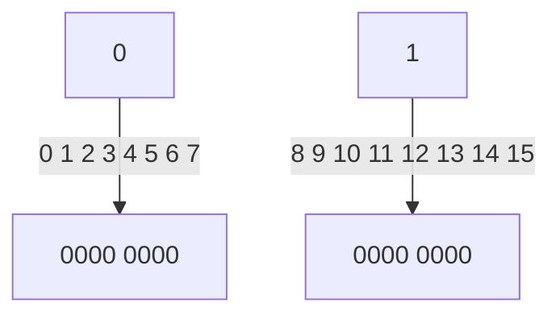

## Overview

Redis（Remote Dictionary Server 远程字典服务） 是一个由 C 语言编写的、开源的、可持久化的、key-value 形式的 **NoSQL** 数据库。支持的常用数据类型包含：**String，Hash，List，Set，SortedSet**。主要应用场景：缓存热门内容、排行榜、在线好友列表、任务队列、网站访问统计、数据过期处理、分布式集群架构中 session 的分离等。

NoSQL（Not Only SQL）意为不仅仅是 SQL，泛指非关系型数据库。按照其存储数据的格式可以分为：**键值对存储、列存储、文档型存储、图形存储**。

Redis 中的核心对象称为 **RedisObject**，[参考这里](https://redisbook.readthedocs.io/en/latest/datatype/object.html)。主要关注类型 Type 和编码方式 Encoding，Type 记录了对应 Value 的类型，Encoding 记录了编码。

```c
// 可能已经过时了，参考一下即可。
/*
 * Redis 对象
 */
typedef struct redisObject {
    // 类型
    unsigned type:4;

    // 对齐位
    unsigned notused:2;

    // 编码方式
    unsigned encoding:4;

    // LRU 时间（相对于 server.lruclock）
    unsigned lru:22;

    // 引用计数
    int refcount;

    // 指向对象的值
    void *ptr;

} robj;

/*
 * 对象类型
 */
#define REDIS_STRING 0  // 字符串
#define REDIS_LIST 1    // 列表
#define REDIS_SET 2     // 集合
#define REDIS_ZSET 3    // 有序集
#define REDIS_HASH 4    // 哈希表
......

/*
 * 对象编码
 */
#define REDIS_ENCODING_RAW 0            // 编码为字符串
#define REDIS_ENCODING_INT 1            // 编码为整数
#define REDIS_ENCODING_HT 2             // 编码为哈希表
#define REDIS_ENCODING_ZIPMAP 3         // 编码为 zipmap
#define REDIS_ENCODING_LINKEDLIST 4     // 编码为双端链表
#define REDIS_ENCODING_ZIPLIST 5        // 编码为压缩列表
#define REDIS_ENCODING_INTSET 6         // 编码为整数集合
#define REDIS_ENCODING_SKIPLIST 7       // 编码为跳跃表
```

### 通用操作

- 使用 `help @<group>` 可以分类查看 API 信息。
- Redis 默认划分了 16 个 database，默认使用的是第 0 个，使用 `select n` 命令切换。
  - 使用 `FLUSHDB` 清除当前库所有数据， `FLUSHALL` 清除所有库的所有数据。
- Redis 是 **二进制安全** 的，客户端需要协商好编码方式。
	- 取中文在连接时 `redis-cli --raw`。
- 使用 `type key` 查看类型。
- 使用 `object encoding key` 查看编码。

### 参考

0. [官方文档](http://www.redis.cn/documentation.html)
1. 关于权限：[Redis系列(十一)、Redis6新特性之ACL安全策略（用户权限管理）](https://blog.csdn.net/wsdc0521/article/details/106765856)
2. 常用操作：[菜鸟教程](https://www.runoob.com/redis/redis-keys.html)
3. 关于编码：[Redis五大数据类型内部编码剖析](https://cloud.tencent.com/developer/news/295388)
4. [CAP 定理的含义](https://www.ruanyifeng.com/blog/2018/07/cap.html)

## 常用数据类型

> 常用的有五种，分别是：**String，Hash，List，Set，SortedSet**。除此之外还有：HyperLogLog（2.8.9），GEO（3.2），Stream（5.0），下面只记录常用的五种。

### String

#### str 与 int

String 类型还可以细分为字符串、数值、bitmap 三类。对于不同的类型编码，redis 内部去维护，对用户是完全透明的，[参考](#参考) 中的第 3 条。

```shell
mset k1 hahaha k2 123
type k1 # string
type k2 # string
object encoding k1 # embstr
object encoding k2 # int

# ---- 类型转换是透明的 ----

# append int 变为了 raw
append k2 4
get k2 # 1234
object encoding k2 # raw

# 再 incr 又变为了 int
incrby k2 5
get k2 # 1239
object encoding k2 # int

# 不能转换的话报错
append k2 a
get k2 # 1239a
object encoding k2 # raw
incr k2 # (error) ERR value is not an integer or out of range

```

redis 是二进制安全的，对客户端发来的数据，只存字节流而不进行字符编码，客户端存入和读取时要保证字符编码一致才不会乱码。要注意的是 `strlen key` 返回的是字节长度，例如 utf-8 的一个中文字符，会返回 3。

#### bit

redis 中 bit 与 byte 都由左向右开始索引，如下图。



```shell
setbit key offset value
getbit key offset

setbit k1 2 1 # 0010 0000 即 32 对应 ASCII 为 ' '（空格）
get k1 # " " 直接转换为 ASCII 字符
getbit k1 2 # "1"

strlen k1 # 1
setbit k1 8 1 # 超过两个字节
strlen k1 # 2
# 转换不了 ASCII 的显示十六进制
get k1 # "a\x80" 0010 0000 1000 0000
```

### List

list 是一个双向链表，可以用于模拟堆栈和队列。可重复，按插入顺序有序。

```shell
# --- l r 代表方向 ---

lpush key v1 v2 v3 ...
lpop key

rpush key v1 v2 v3 ...
rpop key

# --- l 代表 list ---

llen key
lrange key start stop
lindex key index
lrem key count element # count > 0 时从左向右数， count < 0 时从右向左数
linsert key before|after pivotElement # 在找到的第一个元素前后插入
ltrim key start stop # 删除两端的元素

# --- b 代表 block ---
# 用于模拟一个FIFO单播队列
blpush
blpop
```

### Set

插入无序，去重。

| 命令                      | 说明                             |
| ------------------------- | -------------------------------- |
| sadd key v1 v2            | 添加                             |
| srem key v1 v2            | 删除                             |
| scard k1 k2               | 获取长度                         |
| sunion k1 k2              | 并集                             |
| sunionstore destkey k1 k2 | 并集，并将结果存在 destKey       |
| sinter k1 k2              | 交集                             |
| sdiff k1 k2               | 差集（在 k1 中不在 k2 中的元素） |
| sismember key v           | 是否存在                         |
| smembers key              | 获取所有值                       |
| smove source dest member  | 将 member 从 source 移入 dest    |

随机操作：

```shell
# 移除并返回随机count个元素
SPOP key [count]
# 返回随机count个元素
SRANDMEMBER key [count]

# 注意：
	# count > 0 时，返回一个去重后的结果集，数量不超过当前集合。
	# count < 0 时，返回一个含有 count 个的结果集，可能重复。
```

### Hash

常用命令：

| 命令              | 说明         |
| ----------------- | ------------ |
| hset key k v      | 赋值         |
| hmset             | 赋值多个     |
| hget key k、hmget | 取值、取多个 |
| hkeys key         | 所有的 k     |
| hvals key         | 所有的 v     |
| hgetall key       | 所有的 k v   |
| hlen key          | 获取长度     |

### SortedSet

去重，按照 **给定分值** 有序，分值相同时按照名称字典序排序，并按照从小到大索引。内部使用 *跳跃链表* 来达到高效排序。

```shell
# 新增
zadd k1 4 lisi 3 zhangsan 5 wangwu

# 获取 score
zrank k1 zhangsan # 3

# 根据索引范围获取
zrange k1 0 -1 # zhangsan lisi wangwu

# 根据 score 范围获取
zrangebyscore k1 3 4 # zhangsan lisi

# 反向获取
zrevrange k1 0 -1 # wangwu lisi zhangsan

# 给 zhangsan 的 score 加 10
zincrby k1 10 zhangsan
zrange k1 0 -1 withscores # lisi 4 wangwu 5 zhangsan 13

# 集合操作需要考虑 权重 和 聚合
# weight 为每个 key 的权重，aggregate 为聚合选项，默认为累加聚合
ZUNION numkeys key [key ...] [WEIGHTS weight] [AGGREGATE SUM|MIN|MAX] [WITHSCORES]

zadd k2 10 user1 20 user2 30 user3
zadd k3 10 user1 20 user2 40 user4

# 默认权重为 1，按照 sum 聚合
zunion 2 k2 k3 withscores # user1=20, user3=30, user2=40, uer4=40
# 添加权重
zunion 2 k2 k3 weights 0.5 1 withscores # user1=15, user3=15, user2=30, uer4=40
# 添加权重与聚合选项 min
zunion 2 k2 k3 weights 0.5 1 aggregate min  withscores # user1=5, user2=10, user3=15, uer4=40
```

## 持久化

将内存中的数据持久化到硬盘中，包含 *RDB*（默认） 和 *AOF* 两种机制。

### RDB

RDB(Redis Database) 机制：在一定的时间内监测 key 的变化，按照制定好的规则进行持久化操作，粒度较大。

有两个与 RDB 相关的命令：  
`save` 同步的持久化；  
`bgsave` 异步的持久化。

可以在配置文件中进行配置。

```shell
#   after 900 sec (15 min) if at least 1 key changed
save 900 1
#   after 300 sec (5 min) if at least 10 keys changed
save 300 10
#   after 60 sec if at least 10000 keys changed
save 60 10000

rdbcompression yes # 是否开启压缩
dir /var/lib/redis	# 快照目录
dbfilename dump.rdb	# 快照名称
```

**过程**

> Whenever Redis needs to dump the dataset to disk, this is what happens:
> - Redis [forks](http://linux.die.net/man/2/fork). We now have a child and a parent process.
>     - This method allows Redis to benefit from copy-on-write semantics.
> - The child starts to write the dataset to a temporary RDB file.
> - When the child is done writing the new RDB file, it replaces the old one.

**优点：**

- 最大化的保留了 redis 的性能，因为落盘是 fork 出的子进程来执行的，父进程不会参与磁盘 IO。
- RDB 类似于将数据序列化，数据集较大时，重启恢复比较快。

**缺点：**

- 粒度大，非正常关闭时，和 AOF 相比会丢失更多数据。
- 如果数据量比较大，fork 子进程可能耗时较多。

### AOF

AOF(Append Only File) 机制：用日志记录每一条操作命令，粒度小。

```shell
appendonly no # 改为 yes 开启
appendfsync no
# no 缓冲区满后落盘（4K）
# always 每一次操作都落盘
# everysec 每隔一秒落盘一次
```

随着时间的推移，AOF 日志会越来越大，可以使用 `BGREWRITEAOF` 命令对现有日志进行合并整理。

RDB 和 AOF 可以同时开启。

## 其它

#todo

>  集群、管道、消息订阅、事务、过期时间（过期删除策略）、溢出删除策略

## 问题

### 一致性哈希

当数据量比较大时，可以按照不同的业务逻辑，将数据存入不同的 redis 节点中（垂直拆分）；或按照 key 进行哈希映射，对数据进行水平拆分，存入不同的节点。

最常见的哈希规则就是取模，缺点是不利于节点扩展，扩展时，需要重新哈希，进行 **过多的数据迁移**。可以使用一致性哈希来 **缓解** 这一问题。

一致性哈希，是指将 **节点与数据** 都映射到一个 **首尾相连的哈希环** 上，如我们可以取对 2 ^n 次方取模（x \% 2^n 可以简化为 x ^ (2^n - 1)）作为哈希函数，当读写数据时，将 key 经过散列后可定位在哈希环上的某一位置，**往顺时针方向找第一个节点**，即为要读写的节点。

当要进行节点的扩展时，只会影响到 key 值散列在新节点到相邻的下一节点之间的数据。减少了数据迁移量。


问题：

1. 节点扩展时，可能会造成击穿。可以选择在没有命中时，依次再寻找相邻的下一节点。
2. 节点数据可能分布不均匀（数据倾斜）。可以增加一层映射关系，在哈希环上设立多个虚拟节点，再将虚拟节点与真实的物理节点建立映射，即一个物理节点，对应多个虚拟节点。节点数量越多，数据就越均匀。
3. 数据分片之后很难实现事务。可以通过只对 key 的若干高位进行散列，如 `[qwer]rty` 、 `[qwer]asd`，只对 qwer 进行散列，则它们将存储在同一个节点中。

### 穿透

指请求没有命中缓存，也没有命中数据库，即每次请求都会查库，常见于网络攻击。可以使用布隆过滤器/布谷鸟过滤器（支持删除）；更方便的是可以写一个空值到缓存中，并设置较长的过期时间。

### 击穿

指某个热点数据（即高并发），突然过期，导致大量请求涌入数据库。可以使用 setnx 加锁，拿到锁的请求才可以访问数据库，待缓存构建完成后，释放锁，后面的请求将可以命中缓存。setnx 一定要设置过期时间，避免当前持有锁的线程意外中断。

### 雪崩

指大批量热点数据过期，造成大量请求涌入数据库（即发生了大量的击穿）。可以使用随机过期时间防止大量数据同时过期，也可以选择在合适的时间（凌晨流量小的时候）更新缓存。这只是减少了雪崩的概率，当大量请求绕过缓存时，要尽可能的防止它们流向数据库，一方面可以考虑击穿的解决方案，除此之外还要考虑服务的限流和降级。

### 双写一致性

[Redis与Mysql双写一致性方案解析 - 知乎 (zhihu.com)](https://zhuanlan.zhihu.com/p/59167071)  
涉及到冗余，必然会造成不一致问题，对于缓存，通过设置过期时间，可以保证最终一致性。**当 redis 作为缓存时**，如何更新 redis 和数据库，是一个值得思考的问题。有这么几个方案：

```java
1. 先更新缓存，再更新数据库。
2. 先更新数据库，再更新缓存。
3. 先删除缓存，再更新数据库。
4. 先更新数据库，再删除缓存。
```

首先排除第一种方案，第一种方案是将 redis 作为数据库使用，起到的是合并写入，减少写库压力的作用，即先将数据放入缓存，每隔一段时间落库一次，它的可靠性应由日志保证。

第二种方案存在线程安全问题，如 T1 先于 T2 更新数据库，并发出更新缓存的请求，但由于网络原因，T2 的更新缓存操作先于 T1 发生了，则缓存中的将是脏数据。

第三种方案可能会有如下操作序列，导致缓存为旧值：

```java
1.T1先删除缓存。
2.T2请求缓存没有命中，查库更新缓存为旧值。
3.T1更新完数据库。
```

可以使用 **延时双删** 策略，操作序列如下：

```java
1.删除缓存
2.更新数据库
3.sleep
4.删除缓存
```

第四步延时删除缓存可以将 T1 更新数据库期间，产生的脏缓存删除掉。对于延时的时间，需要经过测试得出。

第四种先更新数据库，再删除缓存。会存在以下问题：

```java
1.缓存失效
2.T1查询数据库，得到旧值
3.T2更新数据库
4.T2删除缓存
5.T1写旧值到缓存
```

可以分析得出此种情况要比第二种方案的问题发生概率小得多。

既然无论如何都不能保证强一致性，就不要钻牛角尖，要根据业务来取舍，重要数据不缓存，缓存数据不重要，读多写少才缓存。
