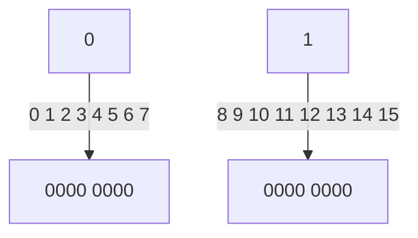

## Overview

- [下载](https://redis.io/downloads/)
- [官方文档](https://redis.io/docs/latest/)
- [命令速查](https://redis.io/docs/latest/commands/)

Redis（**Re**mote **Di**ctionary **S**erver 远程字典服务） 是一个由 C 语言编写的、开源的、可持久化的、key-value 形式的 **NoSQL** 数据库。支持的常用数据类型包含：**String，Hash，List，Set，SortedSet**。主要应用场景：缓存热门内容、排行榜、在线好友列表、任务队列、网站访问统计、数据过期处理、分布式集群架构中 session 的分离等。

**NoSQL**（Not Only SQL）意为不仅仅是 SQL，泛指非关系型数据库。按照其存储数据的格式可以分为：**键值对存储、列存储、文档型存储、图形存储**。

Redis 中的核心对象称为 [**RedisObject**](https://redisbook.readthedocs.io/en/latest/datatype/object.html)。主要关注类型 Type 和编码方式 Encoding，Type 记录了对应 Value 的类型，Encoding 记录了编码。

```c
// 可能已经过时了，参考一下即可。
/*
 * Redis 对象
 */
typedef struct redisObject {
    // 类型
    unsigned type:4;
    // 对齐位
    unsigned notused:2;
    // 编码方式
    unsigned encoding:4;
    // LRU 时间（相对于 server.lruclock）
    unsigned lru:22;
    // 引用计数
    int refcount;
    // 指向对象的值
    void *ptr;
} robj;

/*
 * 对象类型
 */
#define REDIS_STRING 0  // 字符串
#define REDIS_LIST 1    // 列表
#define REDIS_SET 2     // 集合
#define REDIS_ZSET 3    // 有序集
#define REDIS_HASH 4    // 哈希表
......

/*
 * 对象编码
 */
#define REDIS_ENCODING_RAW 0            // 编码为字符串
#define REDIS_ENCODING_INT 1            // 编码为整数
#define REDIS_ENCODING_HT 2             // 编码为哈希表
#define REDIS_ENCODING_ZIPMAP 3         // 编码为 zipmap
#define REDIS_ENCODING_LINKEDLIST 4     // 编码为双端链表
#define REDIS_ENCODING_ZIPLIST 5        // 编码为压缩列表
#define REDIS_ENCODING_INTSET 6         // 编码为整数集合
#define REDIS_ENCODING_SKIPLIST 7       // 编码为跳跃表
```

## 通用命令行操作

- **数据库相关**
  - `select <dbindex>` 切换当前使用的库，Redis 默认划分了 16 个 database，并默认使用第 0 个；
  - `dbsize` 查看当前库 key 的数量；
  - `move <key> <dbindex>` 将指定 key 移动到指定库；
  - `FLUSHDB` 清除**当前库**所有数据；
  - `FLUSHALL` 清除**所有库**的所有数据；
- **key 相关**
  - `keys *` 查看所有 key；
  - `exists <key>` 判断是否存在；
  - `del <key>` 删除指定数据；
  - `expire <key> 秒` 设置过期时间；
  - `ttl <key>` 查看 ttl，-1 表示永不过期，-2 表示已过期；
  - `type <key>` 查看 key 的类型；
  - `object encoding <key>` 查看 value 的类型；
- **其他**
  - `help @<类型>` 分类查看 API 信息；
  - `redis-cli --raw` 取中文时需要在连接串上设置 `--raw`，因为 Redis 是**二进制安全**的，客户端需要协商好编码方式；

**常用操作**：

```shell
# 设置 k1=1 且30s后过期，ex单位是秒，px单位是毫秒
set k1 1 ex 30
# 查看 k1 过期时间，pttl 查看毫秒
ttl k1
# 重新 set 即更新 k1 的值，注意过期时间会被取消
set k1 2
# 使用 keepttl 可延续当前过期时间，如果已经过期则相当于未设置过期时间
set k1 2 keepttl
# 更新时返回旧值
set k1 3 ex 30 get
getset k1 3 # 不能同时设置过期时间
# 使用 nx、xx 实现不存在/存在时才设置
set k1 100 nx # 不存在时设置成功，已存在则返回 null
set k1 100 xx # 已存在则设置成功，不存在则返回 null
# 一次性操作多个键值对，具有原子性
mset k1 1 k2 2
mget k1 k2
msetnx k1 11 k3 3 # 失败，返回 0，虽然因为 k1 已存在
# getrange 截取返回，可以使用正反索引，闭区间
set k1 0123456789
getrange k1 0 3 # 返回 0123
getrange k1 -3 -1 # 返回 789
```

## 常用数据类型

### String

#### str 与 int

String 类型还可以细分为**字符串**、**数值**、**bitmap** 三类。对于不同的类型编码，redis 内部去维护，对用户是完全透明的。

```shell
mset k1 hahaha k2 123
type k1 # string
type k2 # string
object encoding k1 # embstr
object encoding k2 # int

# ---- 类型转换是透明的 ----

# append int 变为了 raw
append k2 4
get k2 # 1234
object encoding k2 # raw

# 再 incr 又变为了 int
incrby k2 5
get k2 # 1239
object encoding k2 # int

# 不能转换的话报错
append k2 a
get k2 # 1239a
object encoding k2 # raw
incr k2 # (error) ERR value is not an integer or out of range

```

注意到上面 `object encoding` 字符串返回有两种类型 `embstr` 和 `raw`：  
embstr（嵌入式字符串）将 Redis 对象头和字符串值连续存储在一块内存中，是一个紧凑的整体。 raw 对象头和字符串值分开存储在两块内存中，通过指针连接。  
embstr 是只读的，如果对 embstr 编码的字符串执行修改操作，Redis 会先将其转换为 raw 编码，再执行修改。

redis 是二进制安全的，对客户端发来的数据，只存字节流而不进行字符编码，客户端存入和读取时要保证字符编码一致才不会乱码。要注意的是 `strlen key` 返回的是字节长度，例如 utf-8 的一个中文字符，会返回 3。

#### bitmap

Redis 中 bitmap 操作以字节为单位存储二进制数据，当设置的偏移量超过当前 bit 串的长度时，会自动扩展并将中间的位初始化为 0，支持的最大长度为 2^32 位 ≈ 42 亿位，即 2^29 Byte = 512 MB.

redis 中 bit 与 byte 都由左向右开始索引，如下图。


```mermaid
flowchart TD  
 byte0[0] -->|0 1 2 3 4 5 6 7| str0[0000 0000]
 byte1[1] -->|8 9 10 11 12 13 14 15| str1[0000 0000]
```

```shell
# 命令格式
setbit key offset value
getbit key offset

setbit k1 2 1 # 0010 0000 即 32 对应 ASCII 为 ' '（空格）
get k1 # " " 直接转换为 ASCII 字符
getbit k1 2 # "1"

# 统计字符串中值为 1 的位的数量
bitcount k1 # 2

# 统计字节长度
setbit k1 7 1 # 设置第7位，仍是一个字节
strlen k1 # 1
setbit k1 8 1 # 超过两个字节
strlen k1 # 2
# 转换不了 ASCII 的显示十六进制
get k1 # 输出 "!\x80" 因为 0010 0001 1000 0000，第一个字节对应 ascii 的 !
```

### List

list 是一个**双向链表**，可以用于模拟堆栈和队列。**可重复**，按插入顺序有序。

```shell
# 从左端插入、弹出
lpush k1 1 2 3 # 顺序 [3,2,1]
lpop k1 # 弹出 3
# 从右端插入、弹出
rpush k2 1 2 3 # 顺序 [1,2,3]
rpop k2 # 弹出 3

# 返回 list 元素个数
llen key
# 根据索引返回元素
lrange key start stop
# 根据索引闭区间返回元素
lindex key index
# 修改指定索引的元素
lset key index value
# 在找到的第一个元素前后插入
linsert key before|after pivotElement 
# 删除|count|个element，count>0时从左向右数，count<0 时从右向左数
lrem key count element 
# 删除索引两端之外的元素，即只保留索引区间内的元素
ltrim key start stop 

# 将 list1 队尾元素弹出并插入 list2 队首
rpoplpush list1 list2

# --- b 代表 block ---
# 用于模拟一个FIFO单播队列
blpush
blpop
```

### Set

插入无序，去重。

| 命令                      | 说明                             |
| ------------------------- | -------------------------------- |
| sadd key v1 v2            | 添加                             |
| srem key v1 v2            | 删除                             |
| scard k1 k2               | 获取长度                         |
| sunion k1 k2              | 并集                             |
| sunionstore destkey k1 k2 | 并集，并将结果存在 destKey       |
| sinter k1 k2              | 交集                             |
| sdiff k1 k2               | 差集（在 k1 中不在 k2 中的元素） |
| sismember key v           | 是否存在                         |
| smembers key              | 获取所有值                       |
| smove source dest member  | 将 member 从 source 移入 dest    |

随机操作：

```shell
# 移除并返回随机count个元素
SPOP key [count]
# 返回随机count个元素
SRANDMEMBER key [count]

# 注意：
	# count > 0 时，返回一个去重后的结果集，数量不超过当前集合。
	# count < 0 时，返回一个含有 count 个的结果集，可能重复。
```

### SortedSet

去重，按照**给定分值**有序，分值相同时按照名称字典序排序，并按照**从小到大索引**。内部使用**跳跃链表**来达到高效排序。

| 命令                                                                                 | 说明                                                                    |
| ---------------------------------------------------------------------------------- | --------------------------------------------------------------------- |
| zadd key score member [s1, m1...]                                                  | 指定分数插入元素                                                              |
| zscore key member                                                                  | 返回指定元素的分数                                                             |
| zrank key member                                                                   | 获取指定元素的排名索引                                                           |
| zrange key start stop                                                              | 根据索引范围返回元素                                                            |
| zrangebyscore key min max<br>- [withscores]<br>- (min (max<br>- limit offset count | 根据 score 范围获取，闭区间<br>withscores 表示额外返回分数<br>( 表示开区间<br>limit 指定偏移量和步数 |
| zrevrange key start stop                                                           | 根据索引反向获取                                                              |
| zincrby key score member                                                           | 给指定元素加指定分数                                                            |
| zrem key member                                                                    | 删除指定元素                                                                |
| zcard key                                                                          | 获取集合元素数量                                                              |
| zcount key min max                                                                 | 统计指定分数范围的元素个数                                                         |

```shell
# 新增
zadd k1 4 lisi 3 zhangsan 5 wangwu

# 获取分数
zscore k1 zhangsan # 3

# 获取元素的排名索引
zrank k1 zhangsan # 0

# 根据索引范围获取
zrange k1 0 -1 # zhangsan lisi wangwu

# 根据 score 范围获取
zrangebyscore k1 3 4 # zhangsan lisi
zrangebyscore k1 (3 4 # lisi
zrangebyscore k1 3 4 limit 1 1 # lisi

# 反向获取
zrevrange k1 0 -1 # wangwu lisi zhangsan

# 给 zhangsan 的 score 加 10
zincrby k1 10 zhangsan
zrange k1 0 -1 withscores # lisi 4 wangwu 5 zhangsan 13

# 集合操作需要考虑 权重 和 聚合
# weight 为每个 key 的权重，aggregate 为聚合选项，默认为累加聚合
ZUNION numkeys key [key ...] [WEIGHTS weight] [AGGREGATE SUM|MIN|MAX] [WITHSCORES]

zadd k2 10 user1 20 user2 30 user3
zadd k3 10 user1 20 user2 40 user4

# 默认权重为 1，按照 sum 聚合
zunion 2 k2 k3 withscores # user1=20, user3=30, user2=40, uer4=40
# 添加权重
zunion 2 k2 k3 weights 0.5 1 withscores # user1=15, user3=15, user2=30, uer4=40
# 添加权重与聚合选项 min
zunion 2 k2 k3 weights 0.5 1 aggregate min  withscores # user1=5, user2=10, user3=15, uer4=40
```

### Hash

常用命令：

| 命令                              | 说明           |
| ------------------------------- | ------------ |
| hset key k1 v1 [k2 v2]          | 赋值，可多个       |
| hmset key k1 v1 [k2 v2]         | 同上           |
| hget key k                      | 取单个属性        |
| hmget key k1 k2...              | 取多个属性        |
| hkeys key                       | 取所有的 k       |
| hvals key                       | 取所有的 v       |
| hgetall key                     | 取所有的 k v     |
| hlen key                        | 获取元素个数       |
| hexists key k                   | 是否存在 k       |
| hdel key k1 k2...               | 删除元素         |
| hincrby/hincrbyfloat key k step | 给 k 属性增加指定步长 |
| hsetnx key k                    | 不存在则设置成功     |

```shell
# h1 = {id:1, name:'zhangsan', gender:1}
hset h1 id 1 name zhangsan gender 1
# 读取单个属性
hget h1 id # 1
# 读取多个属性
hmget h1 id name gender haha # 1 zhangsan 1 null
```

## 持久化

将内存中的数据持久化到硬盘中，包含 *RDB*（默认） 和 *AOF* 两种机制。

### RDB

RDB(Redis Database) 机制：在一定的时间内监测 key 的变化，按照制定好的规则，对某一时刻的数据状态以**快照**的形式进行持久化操作，粒度较大。

有两个与 RDB 相关的命令，可用于手动触发持久化操作：  

- `save` 同步的持久化，阻塞服务，期间不能对外提供服务，慎用；
- `bgsave`(默认) 异步的持久化。

也可以在配置文件中进行配置，满足条件后自动持久化：

```shell
#   after 900 sec (15 min) if at least 1 key changed
save 900 1
#   after 300 sec (5 min) if at least 10 keys changed
save 300 10
#   after 60 sec if at least 10000 keys changed
save 60 10000

# 上面表示指定时间间隔内有n个key发生修改的话，就建立新的快照进行持久化
# 时间间隔是从上一次执行完持久化之后重新开始计算

rdbcompression yes # 是否开启压缩
dir /var/lib/redis	# 快照目录
dbfilename dump.rdb	# 快照名称
```

**过程**

> Whenever Redis needs to dump the dataset to disk, this is what happens:
> - Redis [forks](http://linux.die.net/man/2/fork). We now have a child and a parent process.
>     - This method allows Redis to benefit from copy-on-write semantics.
> - The child starts to write the dataset to a temporary RDB file.
> - When the child is done writing the new RDB file, it replaces the old one.

**优点：**

- 最大化的保留了 redis 的性能，因为落盘是 fork 出的子进程来执行的，父进程不会参与磁盘 IO；
    - 当主进程修改数据时，得益于写时复制的特性，会在新的内存页副本上执行操作，子进程读取的仍然是内存快照数据。
- RDB 类似于将数据序列化，数据集较大时，重启恢复比较快。

**缺点：**

- 粒度大，非正常关闭时，和 AOF 相比会丢失更多数据。
- 如果数据量比较大，可能耗时较多。

### AOF

AOF(Append Only File) 机制：用日志记录每一条操作命令，粒度小。

```shell
appendonly no # 改为 yes 开启
appendfsync no
# no 缓冲区满后落盘（4K）
# always 每一次操作都落盘
# everysec 每隔一秒落盘一次

auto-aof-rewrite-percentage 100  # 当 AOF 文件大小比上次重写后增长100%（即翻倍）时触发
auto-aof-rewrite-min-size 64mb   # 只有当 AOF 文件大小超过64MB时才触发（避免频繁重写小文件）
```

随着时间的推移，AOF 日志会越来越大，可以使用 `BGREWRITEAOF` 命令对现有日志进行重写。

RDB 和 AOF 可以同时开启，此时恢复时优先使用 AOF，若 AOF 文件不存在或损坏且无法修复，则使用 RDB 恢复。

## Spring Data Redis

### 配置

- pom.xml

```xml
<dependency>
    <groupId>org.springframework.boot</groupId>
    <artifactId>spring-boot-starter-data-redis</artifactId>
</dependency>
```

- application.properties

```properties
# Redis 基本配置
spring.redis.host=localhost       # Redis 服务器地址
spring.redis.port=6379            # Redis 服务器端口
spring.redis.password=123456      # Redis 密码
spring.redis.database=0           # 使用的数据库索引（0-15）

# 连接池配置
spring.redis.lettuce.pool.max-active=8   # 最大活跃连接数
spring.redis.lettuce.pool.max-wait=-1ms  # 获取连接的最大等待时间
spring.redis.lettuce.pool.max-idle=8     # 最大空闲连接数
spring.redis.lettuce.pool.min-idle=0     # 最小空闲连接数

# ------

# 集群配置
spring.redis.cluster.nodes=node1:port,node2:port,node3:port
spring.redis.cluster.max-redirects=3 # 最大重定向次数

# 哨兵配置
spring.redis.sentinel.master=mymaster    # 主节点名称
spring.redis.sentinel.nodes=node1:port,node2:port  # 哨兵节点列表
```

- RedisConfig.java

```java
@Configuration
public class RedisConfig {

    @Bean
    public RedisTemplate<String, Object> redisTemplate(RedisConnectionFactory connectionFactory) {
        RedisTemplate<String, Object> template = new RedisTemplate<>();
        template.setConnectionFactory(connectionFactory);
        
        // 设置键的序列化方式
        template.setKeySerializer(new StringRedisSerializer());
        // 设置值的序列化方式（使用 JSON 序列化，方便跨语言和调试）
        template.setValueSerializer(new GenericJackson2JsonRedisSerializer());
        
        // 设置 hash 键和值的序列化方式
        template.setHashKeySerializer(new StringRedisSerializer());
        template.setHashValueSerializer(new GenericJackson2JsonRedisSerializer());
        
        template.afterPropertiesSet();
        return template;
    }
}
```

### RedisTemplate

**基本使用**

```java
@Autowired
private RedisTemplate<String, Object> redisTemplate;

// --- String 类型 ---

// 存储并设置过期时间（1小时）
redisTemplate.opsForValue().set("name", "Henry", 1, TimeUnit.HOURS);
// 获取值
String name = (String) redisTemplate.opsForValue().get("name");
// 递增/递减（适用于数值类型）
redisTemplate.opsForValue().increment("counter", 1); // 原子递增

// --- List 类型 ---

// 从右侧插入元素（LPUSH）
redisTemplate.opsForList().rightPush("tasks", "task1");
redisTemplate.opsForList().rightPush("tasks", "task2");
// 获取列表长度
Long size = redisTemplate.opsForList().size("tasks");
// 获取指定范围的元素（0 到 -1 表示所有元素）
List<Object> tasks = redisTemplate.opsForList().range("tasks", 0, -1);
// 从左侧弹出元素（LPOP）
Object task = redisTemplate.opsForList().leftPop("tasks");

//...
```

**Pipeline**

```java
redisTemplate.executePipelined(new RedisCallback<Object>() {
    @Override
    public Object doInRedis(RedisConnection connection) throws DataAccessException {
        StringRedisConnection stringRedisConn = (StringRedisConnection) connection;
        for (int i = 0; i < 1000; i++) {
            stringRedisConn.set("key:" + i, "value:" + i);
        }
        return null;
    }
});
```

**Lua**

```java
String script = "xxx"
DefaultRedisScript<String> redisScript = new DefaultRedisScript<>();
redisScript.setScriptText(script);
redisScript.setResultType(String.class);
String result = redisTemplate.execute(redisScript, Collections.singletonList("key1"), "arg1", "arg2");
```

### 注解开发

主启动类上添加：`@EnableCaching`，并配置 `RedisCacheManager`:

```java
@Configuration
public class CacheConfig {
    // 配置 Redis 缓存管理器，不配置则默认使用 ConcurrentMapCacheManager 即 JVM 本地缓存
    @Bean
    public RedisCacheManager cacheManager(RedisConnectionFactory factory) {
        // 配置默认过期时间
        RedisCacheConfiguration config = RedisCacheConfiguration
            .defaultCacheConfig()
            .entryTtl(Duration.ofMinutes(10));
        // 对指定分组设置过期时间
        Map<String, RedisCacheConfiguration> cacheConfigs = new HashMap<>();
        cacheConfigs.put("users", RedisCacheConfiguration
                .defaultCacheConfig()
                .entryTtl(Duration.ofDays(365))
            );
        return RedisCacheManager.builder(factory)
            .cacheDefaults(config)
            .withInitialCacheConfigurations(cacheConfigs)
            .build();
    }
}

// 必须添加 @EnableCaching 才能使配置生效
@SpringBootApplication
@EnableCaching
public class Application { ... }
```

| 注解             | 作用                         |
| -------------- | -------------------------- |
| `@Cacheable`   | 有缓存则直接返回，否则执行方法并缓存结果       |
| `@CachePut`    | 强制更新缓存，即无论是否有缓存，都执行方法并缓存结果 |
| `@CacheEvict`  | 在方法执行之前或之后 (默认) 删除指定缓存     |
| `@Caching`     | 组合多个缓存操作                   |
| `@CacheConfig` | 类级缓存配置（统一设置缓存名称、key 生成策略等） |

```java
// 方法结果不为 null 时进行缓存，value 表示缓存组(对应CacheManager中的配置)，最终 key 为 "users::id"
// condition == true 才缓存，还可以使用 unless == true 时不缓存
@Cacheable(value = "users", key = "#id", condition = "#result != null")
public User getUserById(Long id) {
    return userRepository.findById(id).orElse(null);
}

// 强制更新缓存
@CachePut(key = "#user.id")
public User updateUser(User user) {
    return userRepository.save(user);
}

// 删除单个缓存
@CacheEvict(value = "users", key = "#id")
public void deleteUser(Long id) {
    userRepository.deleteById(id);
}
// 删除 "users" 缓存下的所有条目
@CacheEvict(value = "users", allEntries = true)
public void clearAllUsers() {
    userRepository.deleteAll();
}

// 删除多个缓存
@Caching(
    evict = {
        @CacheEvict(value = "users", key = "#id"),
        @CacheEvict(value = "userNames", key = "#id"),
        @CacheEvict(value = "userDetails", key = "#id")
    }
)
public void deleteUser(Long id) {
    userRepository.deleteById(id);
}

```

#### 自定义 Key 生成器

```java
@Component
public class CustomKeyGenerator implements KeyGenerator {
    @Override
    public Object generate(Object target, Method method, Object... params) {
        return "custom:" + method.getName() + ":" + Arrays.toString(params);
    }
}

// 使用自定义 key 生成器
@Cacheable(value = "users", keyGenerator = "customKeyGenerator")
public User getUserById(Long id) {
    return userRepository.findById(id).orElse(null);
}
```

## 其它

#todo

>  集群、管道、消息订阅、事务、过期时间（过期删除策略）、溢出删除策略

## 问题

### 一致性哈希

当数据量比较大时，可以按照不同的业务逻辑，将数据存入不同的 redis 节点中（垂直拆分）；或按照 key 进行哈希映射，对数据进行水平拆分，存入不同的节点。

最常见的哈希规则就是取模，缺点是不利于节点扩展，扩展时，需要重新哈希，进行 **过多的数据迁移**。可以使用一致性哈希来 **缓解** 这一问题。

一致性哈希，是指将 **节点与数据** 都映射到一个 **首尾相连的哈希环** 上，如我们可以取对 2 ^n 次方取模（x \% 2^n 可以简化为 x ^ (2^n - 1)）作为哈希函数，当读写数据时，将 key 经过散列后可定位在哈希环上的某一位置，**往顺时针方向找第一个节点**，即为要读写的节点。

当要进行节点的扩展时，只会影响到 key 值散列在新节点到相邻的下一节点之间的数据。减少了数据迁移量。


问题：

1. 节点扩展时，可能会造成击穿。可以选择在没有命中时，依次再寻找相邻的下一节点。
2. 节点数据可能分布不均匀（数据倾斜）。可以增加一层映射关系，在哈希环上设立多个虚拟节点，再将虚拟节点与真实的物理节点建立映射，即一个物理节点，对应多个虚拟节点。节点数量越多，数据就越均匀。
3. 数据分片之后很难实现事务。可以通过只对 key 的若干高位进行散列，如 `[qwer]rty` 、 `[qwer]asd`，只对 qwer 进行散列，则它们将存储在同一个节点中。

### 穿透、击穿、雪崩

#### 穿透

指请求没有命中缓存，也没有命中数据库，即每次请求都会查库，可能造成较大压力。

解决方案：

1. 可以写一个缺省值到缓存中，并设置较长的过期时间；
2. 使用布隆过滤器作为白名单，将合法的 key 存入其中；当客户端查询时，先查询白名单：
    - 若 key 不存在，就直接返回；
    - 若 key 存在，则查询 redis，若 redis 中不存在 (误判或缓存过期) 则查询数据库更新缓存。

#### 击穿

指某个热点数据（即高并发），突然过期，导致大量请求涌入数据库。

解决方案：

(必须) 互斥更新：使用分布式锁，拿到锁的请求才可以访问数据库，待缓存构建完成后，释放锁，后面的请求将可以命中缓存。需要注意进行双重检测，即拿到锁后先查缓存，若命中则直接返回。并且要考虑穿透问题。

尽管互斥更新避免了所有请求一股脑达到数据库，但如果缓存更新较慢，可能会影响用户体验，例如刷新出现空白页，可以结合业务需求，提前预热另一份缓存，查询时如果 A 缓存未命中 (未更新完成)，则查询 B 缓存。

#### 雪崩

指大批量热点数据过期，造成大量请求涌入数据库（即发生了大量的击穿）。

解决方案：可以使用随机过期时间防止大量数据同时过期，也可以选择在合适的时间（凌晨流量小的时候）更新缓存。这只是减少了雪崩的概率，当大量请求绕过缓存时，要尽可能的防止它们流向数据库，一方面可以考虑击穿的解决方案，除此之外还要考虑服务的限流和降级。

### 双写一致性

涉及到冗余，必然会造成不一致问题，对于缓存，通过设置过期时间，可以保证最终一致性（以数据库为主）。

> [!node] 前提  
> 缓存操作和数据库操作不在同一个事务边界内，数据库保证数据的权威性，缓存用于辅助加速（可丢失、可重建）。
>
> 要保证强一致性的话，可能想到同步双写并加锁，当缓存操作的失败时去回滚数据库，但要注意加锁只能解决 “并发冲突”，无法解决 “跨系统一致性”，跨系统是无法实现强原子性的，数据库事务中无法保证一定能正确感知到缓存操作的最终结果，例如网络超时，未收到缓存更新成功的响应导致数据库操作回滚。
>
> 所以下面讨论的方案均在“数据库操作与缓存操作是两个独立的操作，即数据库和缓存是两个独立的系统，它们的操作无统一事务约束、无统一锁控制、故障相互独立。”的前提下。

数据更新顺序有下面几种，需要结合实际业务 (是否允许短暂不一致、丢失数据) 选择最合适的：

1. 先更新缓存，再更新数据库；
2. 先更新数据库，再更新缓存；
3. 先删除缓存，再更新数据库；
4. 先更新数据库，再删除缓存。

**方案 1** 先更新缓存，再更新数据库，是将 redis 作为数据库使用，起到的是合并写入，减少写库压力的作用，即先将数据放入缓存，每隔一段时间落库一次，它的可靠性应由日志保证。

**方案 2** 先更新数据库，再更新缓存，多线程下可能会有脏数据，如 T1 先于 T2 更新数据库，并发出更新缓存的请求，但由于网络原因，T2 的更新缓存操作先于 T1 发生了，则缓存中的将是脏数据。

```txt
1.T1更新数据库；
2.T2更新数据库；
3.T2更新缓存；
4.T1更新缓存。(脏数据)
```

**方案 3** 先删除缓存，再更新数据库，问题同 2，考虑有如下操作序列：

```txt
1.T1先删除缓存；
2.T2请求缓存没有命中，查库更新缓存为旧值；
3.T1更新完数据库。
```

可以使用**延时双删**策略，操作序列如下：

```txt
1.删除缓存；
2.更新数据库；
3.sleep；
4.删除缓存；
```

第四步延时删除缓存可以将 T1 更新数据库期间，产生的脏缓存删除掉。对于延时的时间，需要经过测试得出。感觉延时双删有点扯，和方案 4 先更新数据库再删除缓存效果一样。

**方案 4** 先更新数据库，再删除缓存，可能会存在以下问题：

```txt
1.缓存失效；
2.T1查询数据库，得到旧值；
3.T2更新数据库；
4.T2删除缓存；
5.T1写旧值到缓存；
```

此种情况要比方案 2 的问题发生概率小得多。

既然无论如何都不能保证强一致性，就不要钻牛角尖，要根据业务来取舍。最终一致性可以通过设置过期时间、将删除缓存失败的操作发送到消息队列进行重试兜底。
