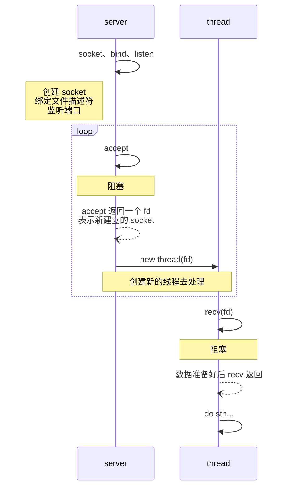
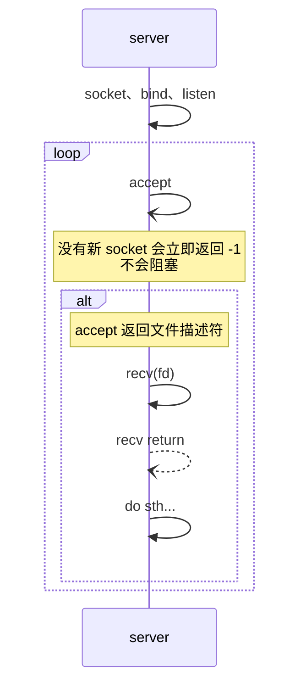
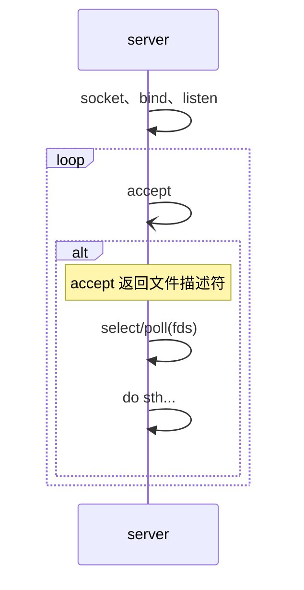
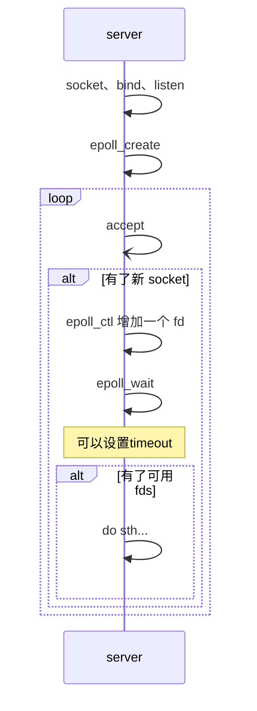

## Overview

> [!quote]
> - 参考
> 	- [JAVA中BIO、NIO、AIO的分析理解](https://developer.aliyun.com/article/726698)
> 	- [理解什么是BIO/NIO/AIO](https://segmentfault.com/a/1190000037714804)
> 	- [nginx 事件机制原理](https://www.cnblogs.com/gaogch/p/10756980.html)
> 	- [epoll](https://zh.wikipedia.org/wiki/Epoll)
> 	- [如果这篇文章说不清 epoll 的本质，那就过来掐死我吧！](https://www.6aiq.com/article/1564634702930)
> 	- [linux网络之数据包的接受过程](https://www.jianshu.com/p/e6162bc984c8)
> - 关于 AIO
> 	- [IOCP](https://zh.wikipedia.org/wiki/IOCP)
> 	- [linux AIO 那点事儿](https://developer.aliyun.com/article/341711)
> 	- [Linux 异步 I/O 框架 io_uring](https://arthurchiao.art/blog/intro-to-io-uring-zh/)

BIO - 同步阻塞 IO  
NIO - 同步非阻塞 IO  
AIO - 异步非阻塞 IO

烧水壶的例子：一个人管理一排烧水壶同时烧水。  
BIO 每次只站在一个水壶前，等水开了并处理完后，再去下一个水壶，即便其他水壶开了也不管。  
NIO 轮询这一排水壶，若有水开了则去处理，若没有开则继续轮询。  
AIO 一边干其他事情，听到水壶响了，再去处理，处理完之后，可以再去干其他事儿，直到听到下一个水壶响。

从 BIO 到 NIO 目的是为了减少阻塞、减少用户态和内核态的切换，将线程的创建和调度推迟到真正需要处理任务的时候。本质上是让内核帮我们做了更多的事情，依赖于内核提供这样的特性，提供相关的系统调用才能够完成。  
需要了解的 Linux 系统调用：socket、bind、listen、accept、recv、select、poll、epoll...

数据从网卡传输到内存 (内核区) 后发起中断请求，CPU 响应中断，根据网络数据包中的 IP 端口等信息找到对应的 socket，并将数据写入到此 socket 对应的缓冲区，接着唤醒阻塞在该 socket 上的线程。

## 传统 BIO

注：顺序图中实线实心箭头是同步调用，实线非实心箭头为异步调用，虚线非实心箭头为返回消息。

缺点：每个 socket 对应一个线程，相当于 1:1，线程的开辟和调度需要资源，且当数据还没有准备好时，accept 和 recv 会阻塞线程。

## NIO

#### 在用户态轮询

缺点：虽然规避了 1:1 问题，但仍然需要循环 recv(fd)，每次都需要陷入内核态。如建立了 100 个链接，但某一时刻只有 1 个链接发送数据了，剩下 99 次都是无用的，如果能够一次性批量传递多个文件描述符就好了。

#### 多路复用

select、poll 提供了一次调用传递多个文件描述符的能力，将用户态的轮询转移到内核中，避免无用的陷入内核态。

##### select、poll

> select() and pselect() allow a program to **monitor multiple file descriptors**, waiting until one or more of the file descriptors become "ready" for some class of I/O operation (e.g., input possible).A file descriptor is considered ready if it is possible to perform a corresponding I/O operation (e.g., read(2), or a sufficiently small write(2)) without blocking.
>
> select() can monitor only file descriptors numbers that are **less than FD_SETSIZE**（默认为 1024）; poll(2) does not have this limitation.

select、poll 通过一次系统调用，批量传递多个文件描述符，由内核去进行遍历，返回有数据的文件描述符，减少了用户态到内核态的转换。

还有可以优化的点在于，每次都需要传递所有的文件描述符（从用户空间传递到内核空间），存在大量重复的数据，如果能进一步细化这些文件描述符的维护就好了。让内核去维护它们，当程序需要的时候直接去询问，内核返回可用的文件描述符。

##### epoll

epoll 在内核空间开辟了一个空间来维护这些文件描述符，与之相关的系统调用如下。

| 调用         | 描述                                                          |
| ------------ | ------------------------------------------------------------- |
| epoll_create | 创建一个 epoll 并返回其 fd                                     |
| epoll_ctl    | 向指定的 epoll 中增删改文件描述符   (int epfd, int op, int fd, struct epoll_event \*event)                            |
| epoll_wait   | 从 epoll 读取可用的文件描述符，可指定 timeout，超时后立即返回, 当 timeout 为 -1 时，会阻塞 |

优点：除了克服 select、poll 重复传递 fd 的问题，对于多核 cpu 来说，对 epoll 的维护和程序请求 fd 两件事可以达到 **并行**，充分发挥多核处理器的优势。select 和 poll 是程序主动调用，内核才会去遍历 fds，然后返回可用 fds，而 epoll 的维护不需要程序去干预，内核可以在网卡中断发生时，去更新 epoll 状态。

## 小结

**同步和异步** 是指：是否需要程序去亲自读取 IO 数据。

**同步阻塞** 主要是指 accept 和 recv 时会阻塞，accept 是阻塞在 socket 的建立，recv 会阻塞在从 socket 读取数据，即网卡接收到的数据从内核空间到用户空间的拷贝 (所以有“零拷贝”一说)。  
**同步非阻塞**，只避免了线程在 accept 时的阻塞，recv 时仍然会阻塞。

这里先不记录 **AIO**，因为目前只有 Windows 很好的实现了 AIO，Linux 上的 AIO 用的还不是很广泛。AIO 实际上还是内核进一步升级，原本由程序主动做的事情 (读取 IO)，交由内核完成 (将数据从内核空间拷贝到用户空间)，然后去通知程序，这就是同步和异步的区别所在。

**NIO 相比于 BIO**，将无效的链接阻挡在了线程创建/调度之前，减少了资源浪费。  
**AIO 相比于 BIO**，将暂时无法处理的请求 (IO 没有准备好)，阻挡在了线程创建/调度之前，让线程直接使用读好的数据，而不是亲自去读 (阻塞)，进一步压榨了 CPU。
