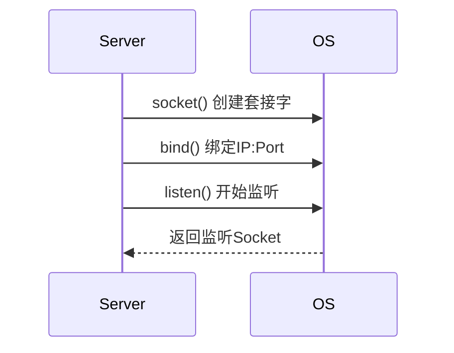
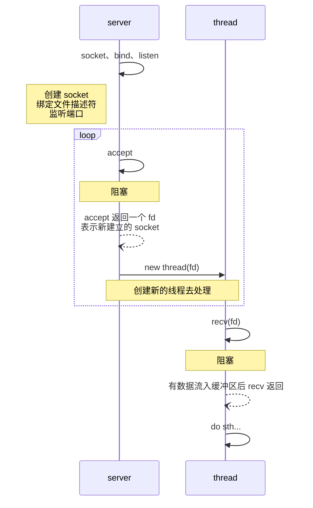
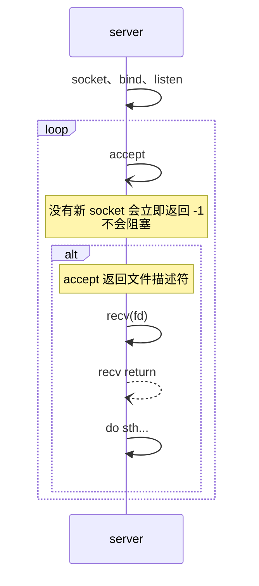
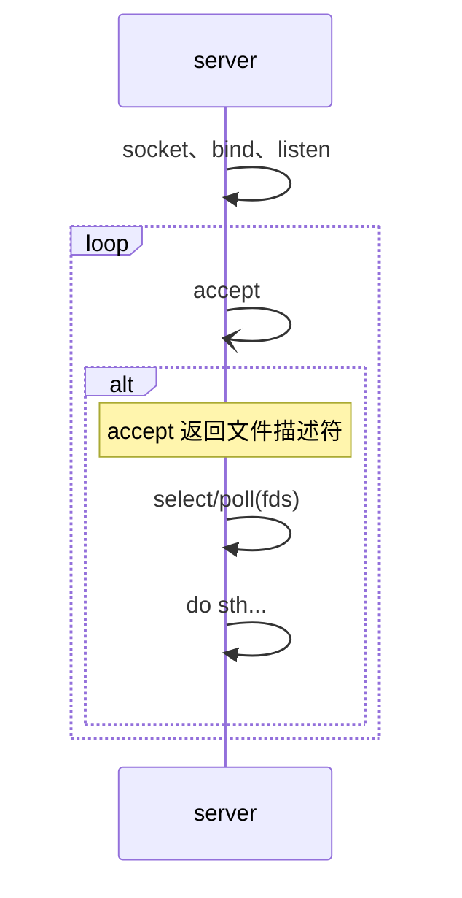
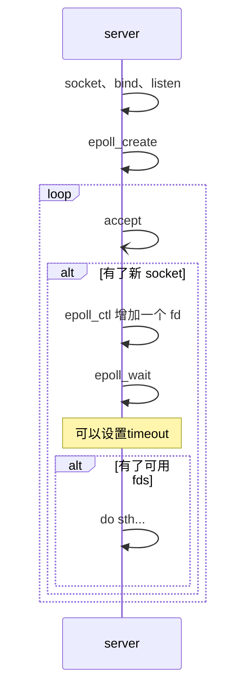

## Overview

> [!quote]
> - 参考
> 	- [JAVA中BIO、NIO、AIO的分析理解](https://developer.aliyun.com/article/726698)
> 	- [理解什么是BIO/NIO/AIO](https://segmentfault.com/a/1190000037714804)
> 	- [nginx 事件机制原理](https://www.cnblogs.com/gaogch/p/10756980.html)
> 	- [epoll](https://zh.wikipedia.org/wiki/Epoll)
> 	- [如果这篇文章说不清 epoll 的本质，那就过来掐死我吧！](https://www.6aiq.com/article/1564634702930)
> 	- [linux网络之数据包的接受过程](https://www.jianshu.com/p/e6162bc984c8)
> - 关于 AIO
> 	- [IOCP](https://zh.wikipedia.org/wiki/IOCP)
> 	- [linux AIO 那点事儿](https://developer.aliyun.com/article/341711)
> 	- [Linux 异步 I/O 框架 io_uring](https://arthurchiao.art/blog/intro-to-io-uring-zh/)

BIO - 同步阻塞 IO  
NIO - 同步非阻塞 IO  
AIO - 异步非阻塞 IO

烧水壶的例子：一个人管理一排烧水壶同时烧水。  
BIO 每次只站在一个水壶前，等水开了并处理完后，再去下一个水壶，即便其他水壶开了也不管。  
NIO 轮询这一排水壶，若有水开了则去处理，若没有开则继续轮询。  
AIO 一边干其他事情，听到水壶响了，再去处理，处理完之后，可以再去干其他事儿，直到听到下一个水壶响。

从 BIO 到 NIO 目的是为了减少阻塞、减少用户态和内核态的切换，**将线程的创建和调度推迟到真正需要处理任务的时候**。本质上是让内核帮我们做了更多的事情，依赖于内核提供这样的特性，提供相关的系统调用才能够完成。  
需要了解的 Linux 系统调用：socket、bind、listen、accept、recv、select、poll、epoll...

## 传统 BIO

注：顺序图中实线实心箭头是同步调用，实线非实心箭头为异步调用，虚线非实心箭头为返回消息。

```mermaid
sequenceDiagram
    participant Server
    participant OS
    Server->>OS: socket() 创建套接字
    Server->>OS: bind() 绑定IP:Port
    Server->>OS: listen() 开始监听
    OS-->>Server: 返回监听Socket
```

```mermaid
sequenceDiagram
participant server
participant thread
server->>server: socket、bind、listen
Note left of server: 创建 socket <br/> 绑定文件描述符 <br/> 监听端口
loop
	server->>server: accept
	Note over server: 阻塞
	server--)server: accept 返回一个 fd <br/> 表示新建立的 socket
	server->>thread: new thread(fd)
	Note over server,thread: 创建新的线程去处理
end
thread->>thread: recv(fd)
Note over thread: 阻塞
thread--)thread: 有数据流入缓冲区后 recv 返回
thread->>thread: do sth...
```

如上两个图所示，服务端的 `Acceptor` 线程负责创建 `监听socket`，调用 `accept` 阻塞等待客户端连接，当客户端链接建立时，`accept` 返回一个 `fd` 关联该链接对应的 `通信socket`，分发给新的 `业务线程` 去处理，业务线程调用 `recv` 阻塞直到有数据到来，接着就是应用层读取网络请求、处理业务逻辑、写出返回消息。

缺点：相当于 `1:1`，**每个客户端通信 Socket 对应一个独立的处理线程**，线程的开辟和调度需要资源，且当数据还没有准备好时，`recv` 会阻塞线程。

## NIO

#### 在用户态轮询

```mermaid 
sequenceDiagram
participant server
server->>server: socket、bind、listen
loop
	server-)server: accept
	Note over server: 没有新 socket 会立即返回 -1 <br/> 不会阻塞
	alt
		Note over server: accept 返回文件描述符
		server->>server: recv(fd)
		server--)server: recv return
		server->>server: do sth...
	end
end
```

注意在该模式下，上图中的 accept 和 recv 都是**非阻塞**式调用，会立即返回结果。

服务端 `Acceptor` 线程不仅负责监听客户端连接并且轮询 `通信socket` 的数据，即新的连接建立后不直接分发给 `业务线程`，而是推迟到有数据到来时。

缺点：虽然规避了 1:1 问题，但仍然需要循环 `recv(fd)`，每次调用都需要陷入内核态。如建立了 100 个链接，但某一时刻只有 1 个链接发送数据了，剩下 99 次都是无用的，浪费了 CPU 时间片，如果能够一次性批量传递多个文件描述符就好了。

#### 多路复用

select、poll 提供了一次调用传递多个文件描述符的能力，将用户态的轮询转移到内核中，避免无用的陷入内核态。

##### select、poll

> select() and pselect() allow a program to **monitor multiple file descriptors**, waiting until one or more of the file descriptors become "ready" for some class of I/O operation (e.g., input possible).A file descriptor is considered ready if it is possible to perform a corresponding I/O operation (e.g., read(2), or a sufficiently small write(2)) without blocking.
>
> select() can monitor only file descriptors numbers that are **less than FD_SETSIZE**（默认为 1024）; poll(2) does not have this limitation.

```mermaid 
sequenceDiagram
participant server
server->>server: socket、bind、listen
loop
	server-)server: accept
	alt
		Note over server: accept 返回文件描述符
		server->>server: select/poll(fds)
		server->>server: do sth...
	end
end
```

select、poll 也支持阻塞和非阻塞式的调用，通过一次系统调用，可以批量传递多个文件描述符，由内核去进行遍历，返回有数据的文件描述符，减少了用户态到内核态的转换。

服务端 `Acceptor` 线程监听到新的连接，将其 `fd` 注册到 `Selector` 中，另外 `Poller` 线程负责监测该 `Selector`(通过 select 和 poll 调用)，当有 I/O 事件就绪时进行处理。

**多路复用指的就是一个 Poller 线程可以监听多路 I/O 事件**。对于 Web 容器，处理逻辑就是 Poller 线程将数据从 socket 缓冲区读取到用户空间 (非阻塞读，可以同时处理多个请求)，再将读取完成的 HTTP 报文解析为结构化对象 (HttpRequest)，封装为 Runnable，提交给业务线程池去处理。

注意实际中，可能是一个 Acceptor 线程，多个 Poller 线程，每个 Poller 线程绑定一个 Selector 以避免单个 Poller 线程被慢速 I/O 阻塞，获取更高的吞吐量。

还有可以优化的点在于，每次都需要传递所有的文件描述符（从用户空间传递到内核空间），存在大量重复的数据，如果能进一步细化这些文件描述符的维护就好了。让内核去维护它们，当程序需要的时候直接去询问，内核返回可用的文件描述符。

##### epoll

epoll 在内核空间开辟了一个空间来维护这些文件描述符，与之相关的系统调用如下。

| 调用         | 描述                                                          |
| ------------ | ------------------------------------------------------------- |
| epoll_create | 创建一个 epoll 并返回其 fd                                     |
| epoll_ctl    | 向指定的 epoll 中增删改文件描述符   (int epfd, int op, int fd, struct epoll_event \*event)                            |
| epoll_wait   | 从 epoll 读取可用的文件描述符，可指定 timeout，超时后立即返回, 当 timeout 为 -1 时，会阻塞 |

```mermaid 
sequenceDiagram
participant server
server->>server: socket、bind、listen
server->>server: epoll_create
loop
	server-)server: accept
	alt 有了新 socket
		server->>server: epoll_ctl 增加一个 fd
		server->>server: epoll_wait
		Note over server: 可以设置timeout
		alt 有了可用 fds
			server->>server: do sth...
		end
	end
end
```

优点：除了克服 select、poll 重复传递 fd 的问题，对于多核 cpu 来说，对 epoll 的维护和程序请求 fd 两件事可以达到 **并行**，充分发挥多核处理器的优势。select 和 poll 是程序主动调用，内核才会去遍历 fds，然后返回可用 fds，而 epoll 的维护不需要程序去干预，内核可以在网卡中断发生时，去更新 epoll 状态。

## 小结

网络请求到来时，通过 DMA 将数据包从网卡传输到内核缓冲区后发出中断，CPU 响应中断，接着内核协议栈根据网络数据包中的五元组（源/目的 IP+ 端口 + 协议）定位对应 socket，将数据写入到此 socket 对应的接收缓冲区，然后内核会唤醒阻塞在该 socket 上的线程 (非阻塞则是通过 select/poll/epoll 返回就绪)。然后应用线程从 socket 的接收缓冲区将数据读取到用户空间 (或者使用零拷贝技术)，封装请求，调用业务线程处理。

**同步阻塞**主要指 accept 和 recv 时会阻塞，accept 是阻塞在通信 socket 的建立，recv 会阻塞在从 socket 读取数据，即来一个客户端连接就调用业务线程处理，阻塞在 recv 上，容易受到**半连接**攻击，耗尽业务线程池，无法提供正常服务。

**同步非阻塞、I/O 多路复用**是指通过 select/poll/epoll 等系统调用，实现一个线程可以非阻塞监听多个连接的 I/O 事件，数据准备好后才调用业务线程。

**NIO 相比于 BIO**，将无效的链接阻挡在了业务线程创建/调度之前，仅在数据就绪时才触发业务线程处理，减少了线程资源浪费。

**同步和异步**主要区别是是否需要应用程序去亲自读取 IO 数据。**异步非阻塞**实际上还是内核进一步升级，将 I/O 操作完全交给内核，应用层无需等待数据就绪，内核完成时通过回调通知应用层，应用线程仅在数据准备就绪后参与处理。

**响应式编程**的理念和 NIO 多路复用类似，NIO 仅解决**I/O 非阻塞**，响应式编程进一步解决**业务非阻塞**。通过少量 `EventLoop` 线程轮询处理多个请求流，只有数据准备好了才去处理，避免为每个请求分配线程，减少高并发时线程切换开销，适用于 I/O 密集型任务。  
传统模型每请求占用 1 个线程，线程数≈并发数，高并发时线程切换开销大。响应式模型固定数量的 `EventLoop` 线程（如 CPU 核数）处理所有请求，线程切换几乎为零。
